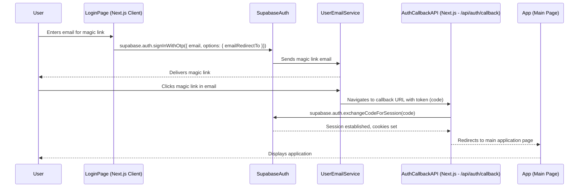

# TechSci AI Hub System Architecture

This document outlines the basic architecture of the TechSci AI Hub application, focusing on key user flows.

## Chat Flow (Streaming MVP)

The following sequence diagram illustrates the process when a user sends a message and receives a streamed response:

```mermaid
sequenceDiagram
    participant User
    participant Frontend (Next.js Client - ChatPage)
    participant Middleware (Next.js)
    participant APIRoute (Next.js - /api/chat/stream)
    participant SupabaseAuth
    participant LLMProvider (e.g., OpenAI)

    User->>Frontend (Next.js Client - ChatPage): Types and sends message
    Frontend (Next.js Client - ChatPage)->>APIRoute (Next.js - /api/chat/stream): POST request with { messages, model }

    APIRoute (Next.js - /api/chat/stream)->>SupabaseAuth: Verify user session
    SupabaseAuth-->>APIRoute (Next.js - /api/chat/stream): Session data (or 401 if unauthorized)

    alt User is Unauthorized
        APIRoute (Next.js - /api/chat/stream)-->>Frontend (Next.js Client - ChatPage): HTTP 401 Error
        Frontend (Next.js Client - ChatPage)-->>User: Displays error / redirects to login
    else User is Authorized
        APIRoute (Next.js - /api/chat/stream)->>LLMProvider (e.g., OpenAI): Request chat completion (stream=true)
        LLMProvider (e.g., OpenAI)-->>APIRoute (Next.js - /api/chat/stream): Streams back response chunks
        APIRoute (Next.js - /api/chat/stream)-->>Frontend (Next.js Client - ChatPage): Streams response via Vercel AI SDK (StreamingTextResponse)
        Frontend (Next.js Client - ChatPage)-->>User: Displays streamed message incrementally
    end
```

### Key Components:

*   **Frontend (Next.js Client - ChatPage):** The user interface built with React (TSX) and ShadCN UI components. Uses the `useChat` hook from the Vercel AI SDK to manage chat state and stream handling.
*   **Middleware (Next.js):** Located at `src/middleware.ts`, it intercepts requests to protected routes, verifies user authentication using Supabase, and redirects unauthenticated users to the login page. It also refreshes Supabase sessions.
*   **API Route (`/api/chat/stream`):** A Next.js Edge Function that handles chat requests. It validates the user's session with Supabase, communicates with the selected LLM provider (e.g., OpenAI), and streams the LLM's response back to the frontend.
*   **Supabase Auth:** Provides user authentication (magic links, OAuth) and session management. Used by both middleware and API routes to secure access.
*   **LLM Provider:** The large language model service (e.g., OpenAI, or potentially others) that generates the chat responses.

## Authentication Flow (Magic Link Example)


